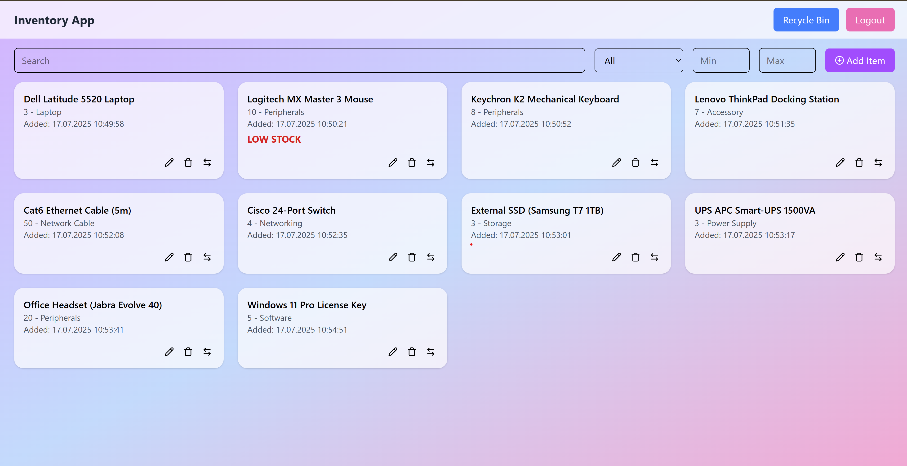
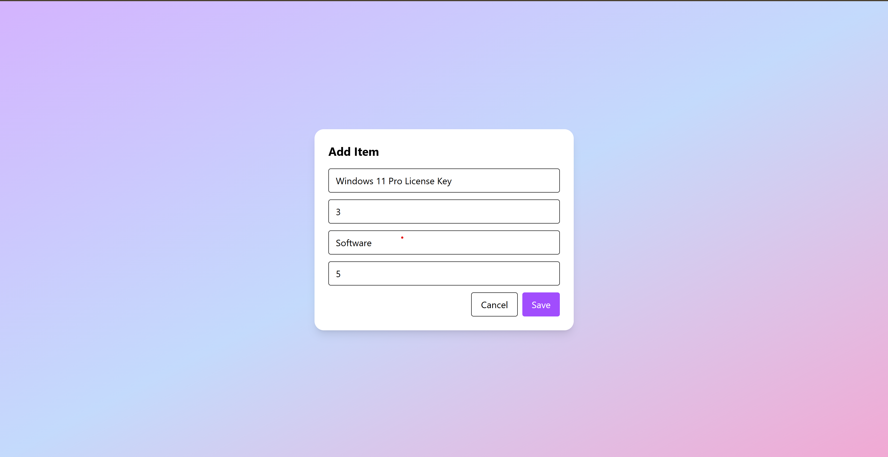
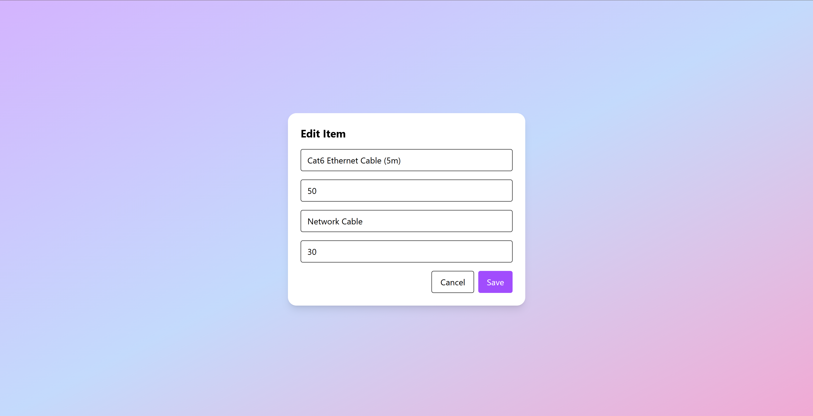
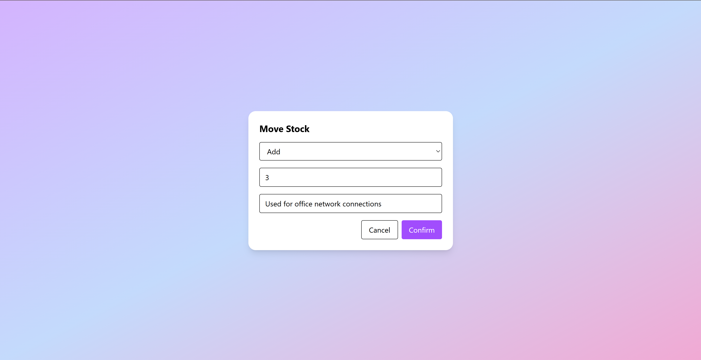
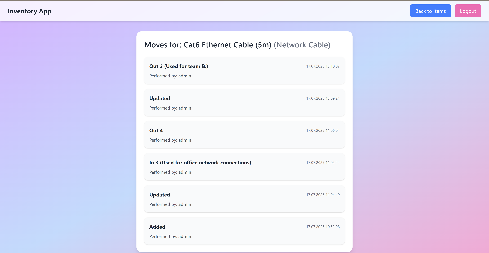
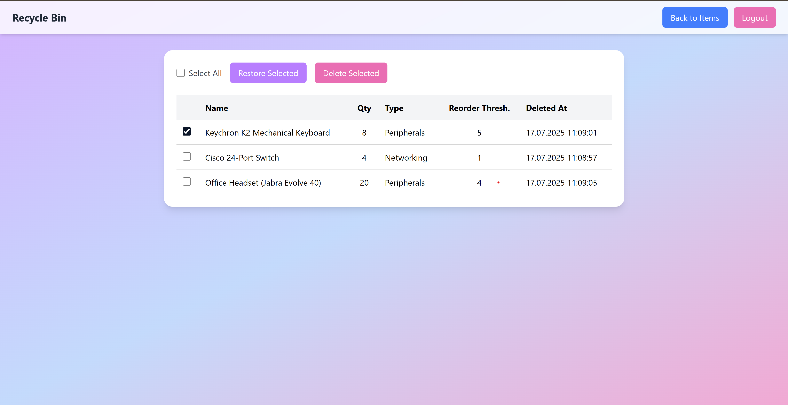

### 📦 Inventory App

A simple and efficient Inventory Management Web App built with React (frontend) and .NET + Microsoft Server SQL (backend).
You can manage items, track quantities, and move items in or out of stock easily.

## 🚀 Features
- ✅ Add, edit, and delete items
- ✅ Move items (increase or decrease quantity)
- ✅ Recycle bin for deleted items
- ✅ User authentication
- ✅ Simple and clean UI

## 📸 Screenshots

### Login Page

### Items Page

### Add Item Page

### Edit Item Page

### Move Item Page

### Item Moves Page

### Recycle Page

